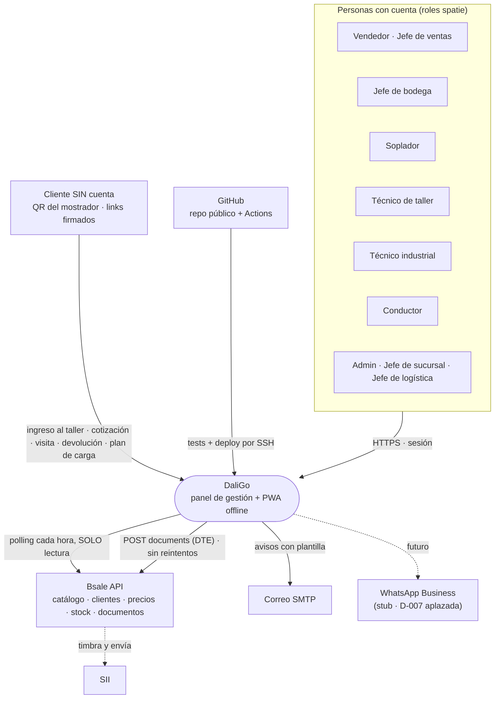
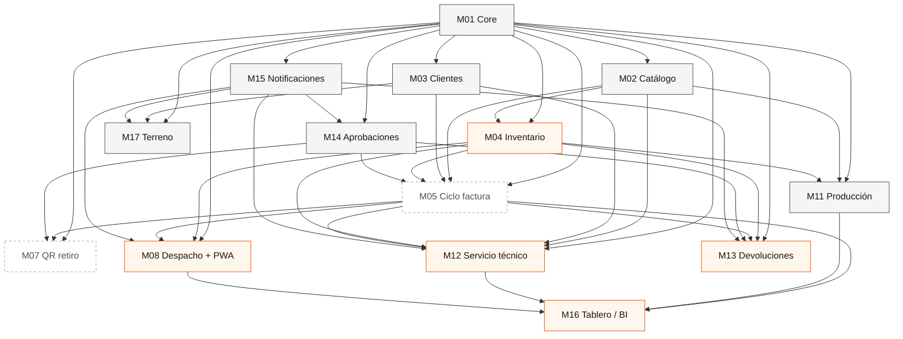
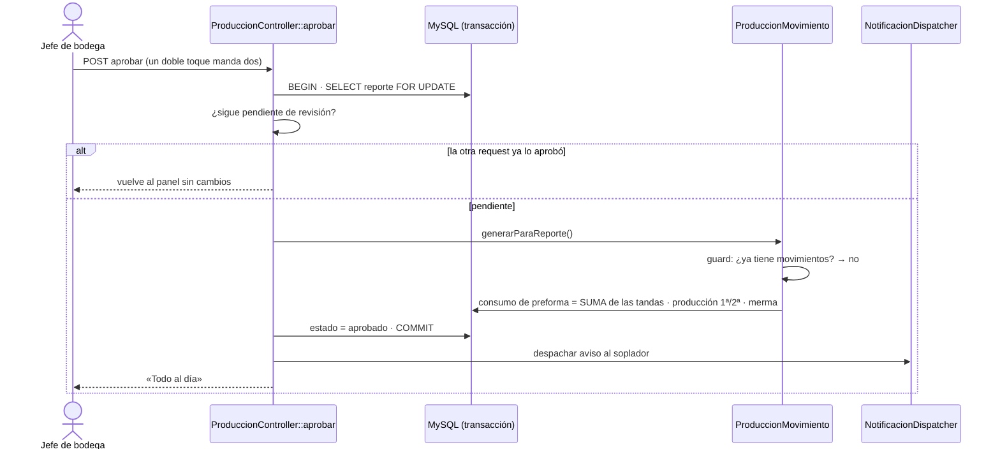
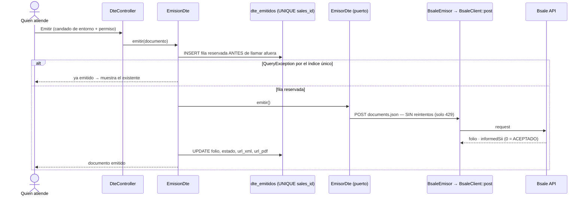
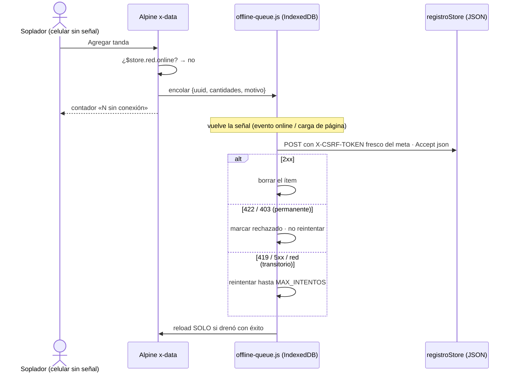
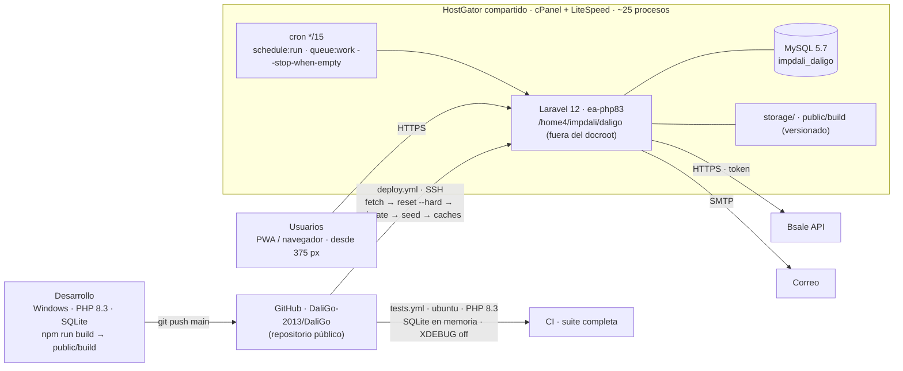
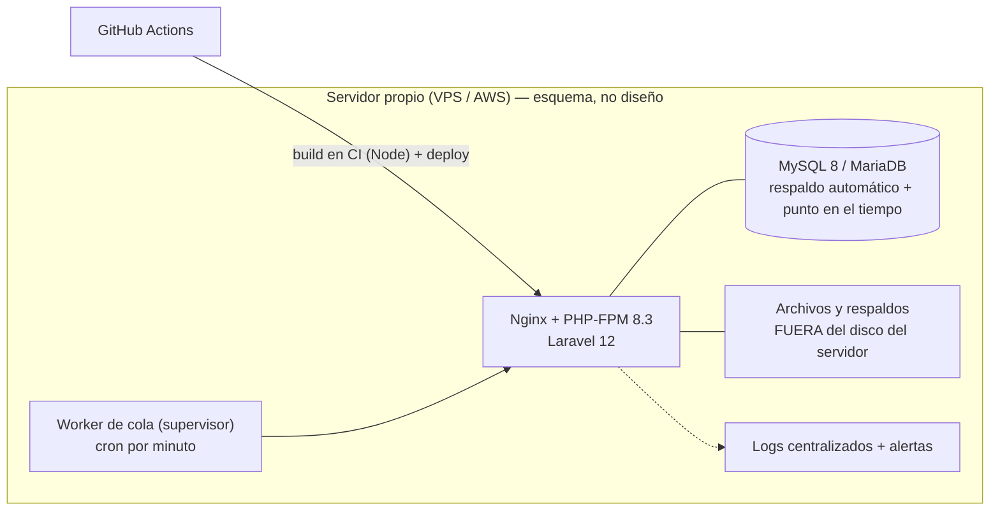

# DaliGo — Documento de arquitectura (arc42)

> **v1 · 2026-09-08 · mantiene:** Marcos Uribe. Formato **arc42** (12 secciones; las que hoy no aportan quedan cortas a propósito).
>
> **Qué documento responde qué:** la biblia (`PROYECTO_DALIGO.md`) dice **qué** hace el sistema; `docs/RUTA-MAESTRA.md` dice **cuándo y en qué estado**; `HANDOFF.md` dice **cómo quedó cada módulo**; `CLAUDE.md` dice **cómo se trabaja y qué salió mal**. Este dice **cómo está construido y por qué** — las vistas y las decisiones.
>
> **Regla de mantención:** todo lo que se pueda **derivar del código se deriva** (módulos ← carpetas, permisos ← seeder, estados ← constantes, menú ← `MenuPrincipal`); solo se dibujan a mano el contexto, el despliegue y las secuencias, y se revisan al cerrar cada módulo (checklist §3 de `PROTOCOLO-SESION`). Un diagrama que no coincide con el código se corrige o se borra — no se deja "por si acaso".

---

## 1. Introducción y objetivos

**Qué es.** Panel de gestión interno (ERP ligero) multi-sucursal + PWA móvil, para Importadora DALI (Chile): distribución, producción propia de botellones y servicio técnico. **Complementa Bsale, no lo reemplaza**: Bsale sigue siendo el emisor electrónico ante el SII.

**Objetivo del sistema** (biblia §1): eliminar el papel del ciclo completo de la factura —cotización → autorización → guía → entrega → cierre— y dar trazabilidad a operaciones que hoy viven en memoria, Excel y WhatsApp.

**Los cinco objetivos de arquitectura** (lo que decide cuando dos soluciones compiten):

| # | Objetivo | Por qué manda |
|---|---|---|
| A1 | **Correr en hosting compartido sin daemons** | Es el entorno real hasta la migración: sin Node, sin Redis, cron cada 15 min, ~25 procesos |
| A2 | **Complementar Bsale sin duplicar la verdad** | Bsale es dueño del stock, los precios y los DTE; DaliGo espeja y traduce |
| A3 | **El celular en planta y en ruta es el dispositivo principal** | Sopladores, técnicos y conductores operan con el teléfono, a veces sin señal |
| A4 | **Un doble toque es una sola operación** | Todo lo que mueve inventario, dinero o estado es idempotente por construcción (locks, índices únicos, UUID) |
| A5 | **Lo que se afirma se verifica** | Reglas de UI y de negocio viven como *candados* (tests estructurales) y se prueban por mutación |

**Interesados**

| Quién | Rol frente al sistema |
|---|---|
| Mauricio (gerente) | Sponsor; decide alcance y autoriza lo tributario |
| Luis Lazcano | Sponsor, jefe de Coquimbo; autor de las 18 reglas de negocio |
| Carlos | Jefe de proyecto desde sept-2026; seguimiento y auditoría interna |
| Marcos Uribe | Desarrollo, operación del deploy, documentación |
| Víctor | Sysadmin interno (cPanel, correo, token Bsale) |
| Contabilidad | Dueña de las 9 reglas de DTE (biblia §10.2) |
| Usuarios por rol | Vendedor, jefe de ventas, jefe de bodega, soplador, técnico, técnico industrial, conductor, jefe de sucursal, jefe de logística, admin — y el **cliente sin cuenta** (QR y links firmados) |

---

## 2. Restricciones

| Tipo | Restricción | Consecuencia en el diseño |
|---|---|---|
| Plataforma | **PHP 8.3.31** fijado en `composer.json`; **Laravel 12**; Blade + Alpine.js; Tailwind v4 | Local = producción; sin Livewire (a pesar de la spec inicial) |
| Base de datos | **MySQL 5.7**: sin CTE, sin window functions, sin `JSON_TABLE`; `utf8mb4_unicode_ci`; `VARCHAR(191)` en únicos | Agregaciones en PHP o `GROUP BY` plano; tests en SQLite no atrapan DDL de FK (ver bitácora [2026-06-30]) |
| Hosting | HostGator compartido, cPanel + LiteSpeed, **sin Node**, sin Redis, **sin procesos daemon**, cron reescrito si es < 15 min (I-01), ~25 procesos | Cola `database` drenada por cron `*/15`; `public/build` versionado; latencia de avisos ≤ 15 min aceptada |
| Integración | **Bsale es el emisor único** ante el SII; el ambiente lo define **solo el token**; sandbox no timbra; sin webhooks confirmados (D-005) | Espejo por polling; puerto `EmisorDte`; POST sin reintentos |
| Seguridad | **Repositorio público** (D-012) | Nada secreto versionado: token, `.p12`, CAF viven en `.env`; incidentes redactados |
| Producto | UI en **español**; paleta estricta de 4 colores; dos anchos de página; componentes `x-*` obligatorios; mobile-first 375/768/1024 | Candados estructurales en `tests/Feature/*` (paleta, ancho, marco, Volver, ⓘ) |
| Organización | Varias sesiones (humanas e IA) sobre el mismo repo | Worktree propio por sesión; commit en cuanto está verificado (bitácora [2026-08-10/13/14]) |

---

## 3. Contexto y alcance

**Interfaces externas**

| Sistema | Protocolo | Dirección | Frecuencia | Dónde vive |
|---|---|---|---|---|
| Bsale · espejo | REST/JSON, token en header | Bsale → DaliGo (lectura) | catálogo :00 · clientes :15 · precios :30 · stock :45 · documentos :30 | `app/Services/Bsale/*Sync.php`, `routes/console.php` |
| Bsale · emisión | REST/JSON | DaliGo → Bsale (escritura) | por acción del usuario | `BsaleEmisor` detrás del puerto `EmisorDte` |
| Correo | SMTP | DaliGo → cliente/usuarios | por evento; reintento cada 15 min | `CanalMail`, `notificaciones:reintentar` |
| Cliente público | HTTPS, **links firmados** + `throttle` + honeypot | Cliente → DaliGo (solo escribe) | por QR/link | `routes/web.php` grupo público, `Controllers/Publico/*` |
| GitHub | SSH desde Actions | GitHub → servidor | cada push a `main` | `.github/workflows/deploy.yml` |

---

## 4. Estrategia de solución

- **Monolito Laravel modular.** Un solo despliegue; los 17 módulos de la biblia son carpetas por dominio en `Services/`, `Controllers/Admin/` y `Models/`. Sin microservicios: A1 lo prohíbe y el tamaño (20–40 usuarios) no lo pide.
- **Render en servidor (Blade) + Alpine mínimo.** El JS vive en `resources/js/app.js` y en `x-data` de las vistas; no hay framework de frontend. Lo que necesita estado (simulador, cola offline, paneles) lo lleva Alpine.
- **Espejo de Bsale de solo lectura** (ADR-002): las tablas `productos`, `precios`, `listas_precios`, `stocks`, `bodegas`, `clientes`, `documentos_venta` se llenan por polling; DaliGo **nunca** escribe stock. Lo que DaliGo produce (kardex de producción, órdenes de taller, agenda) es suyo.
- **Puerto de emisión** (ADR-005): la app depende de `EmisorDte`, no de Bsale; cambiar de emisor es otra implementación.
- **PWA con cola offline** (ADR-006): `sw.js` con cinco reglas y `offline-queue.js` con idempotencia por UUID.
- **Permisos y menú como datos** (ADR-009, ADR-010): roles editables desde la UI, seeder aditivo, `MenuPrincipal` como fuente única del menú.
- **Idempotencia por construcción** (ADR-008): `lockForUpdate` sobre la fila ancla + re-chequeo + índices únicos en todo endpoint que mueve estado o inventario.
- **Verificabilidad** (A5): candados estructurales que leen Blade, rutas y menú; toda regla nueva se prueba por mutación antes de commitear.

---

## 5. Vista de bloques

### 5.1 Nivel 1 — módulos de la biblia y dónde viven en el código

| Módulo | Qué es | Código principal | Estado (RUTA-MAESTRA) |
|---|---|---|---|
| M01 Core | auth, roles, sucursales, configuración, auditoría | `UserController`, `RoleController`, `SucursalController`, `ConfiguracionController`, `AuditController`, `Support/Permisos*` | ✅ |
| M02 Catálogo + precios | espejo de productos y listas | `ProductoController`, `ListaPrecioController`, `Bsale/CatalogSync`, `PriceListSync` | ✅ |
| M03 Clientes | cartera por vendedor | `ClienteController`, `Bsale/ClientSync` | ✅ |
| M04 Inventario | bodegas paramétricas, traslados, espejo de stock | `BodegaController`, `BodegaTrasladoController`, `Inventario/*`, `Bsale/StockSync` | ◐ 40 % (E3/E4 pendientes) |
| M05 Ciclo de la factura | DTE vía Bsale | `DteController`, `DocumentoTributarioController`, `Services/Dte/*`, `Bsale/BsaleEmisor` | ◐ diseñado · **0 emitidos** |
| M07 Retiro anti-fraude | QR por documento | dentro de `Despachos` (`EscaneoDespacho`) | ◐ |
| M08 Despacho + PWA conductor | despachos, hoja de ruta con 3 llaves, entregas | `DespachoController`, `HojaRutaController`, `Entregas/EntregaConductorController`, `Despachos/*` | ◐ 75 % |
| M11 Producción | tandas, aprobación, kardex, OEE, moldes, paradas | `Produccion/MiProduccionController`, `ProduccionController`, `Produccion/*`, `Maquina*`, `Molde*`, `Receta*` | ✅ F1 (85 %) |
| M12 Servicio técnico | taller: ingreso QR, parte, cotización, traslados, informes | `ServicioTecnicoController`, `TiempoReparacionController`, `TrasladoServicioController`, `LoteServicioController`, `Publico/IngresoTaller*`, `Publico/CotizacionPublico*` | ◐ taller completo, alertas 3/6/12 pendientes |
| M13 Devoluciones | formulario del cliente, recepción, reembolso | `DevolucionController`, `Publico/DevolucionPublico*`, `Devoluciones/*` | ◐ 85 % |
| M14 Aprobaciones | motor genérico de solicitudes | `AprobacionController`, `Aprobaciones/*` (`AccionAprobable`, `Acciones/*`) | ✅ |
| M15 Notificaciones | multi-canal con plantillas y audiencias | `Notificaciones/*`, `NotificacionController`, `AvisosNotificacionController` | ✅ |
| M16 Tablero / BI | Inicio «pulso del día», accesos por usuario | `DashboardController`, `DashboardColoresController`, `Support/AccesosDashboard` | ✅ tablero · ⚪ BI |
| M17 Servicio en terreno | agenda industrial, tarifario UF, instalaciones, confirmación del cliente | `AgendaTrabajoController`, `AgendaCierreController`, `ServicioTerrenoController`, `InstalacionController`, `Publico/VisitaConfirmacion*` | ✅ |
| M18 Logística | flota, documentos con vencimiento, conductores, simulador de carga | `VehiculoController*`, `ConductorController`, `SimuladorCargaController`, `CargaRealController`, `Carga/*`, `Logistica/*` | ✅ |
| MSG Mensajes | chat interno | `MensajeController`, `Mensajes/Mensajeria` | ✅ |
| PLAN | página del plan (Gantt) | `PlanProyectoController`, `Plan/CartaGanttExcel`, `Support/PlanProyecto` | ✅ |
| M06 · M09 · M10 | POS · marketplaces · eCommerce | — | standby / backlog |

### 5.2 Dependencias entre módulos (biblia §4, mapa)

*Lectura:* el bloque gris está en producción; el naranjo, parcial; el punteado es lo que **bloquea el go-live** — y M05 depende de las tres decisiones externas abiertas (D-003, D-004, D-005).

### 5.3 Nivel 2 — piezas transversales

| Pieza | Responsabilidad | Regla que encarna |
|---|---|---|
| `Support/FechaNegocio`, `DiasHabiles` | el «hoy» chileno y los días hábiles | ADR-001 |
| `Support/MenuPrincipal` | el menú como datos (módulos, ítems, permisos, badges) | ADR-010 |
| `Support/PermisosSoloAdmin`, `RolesDelSistema`, `PermisosAgrupados` | qué puede tocar cada rol desde la UI de Roles | ADR-009 |
| `Support/AudienciasNotificacion` | quién recibe cada aviso (editable por el dueño) | M15 |
| `Support/AvisosError`, `CodigoIncidente` | textos de 403/404/500 y el código de incidente | D-014, D-015 |
| `Services/Notificaciones/*` | despacho por canal (`database`, `mail`, `whatsapp` stub), preferencias | M15 |
| `Services/Aprobaciones/*` | `AccionAprobable` + acciones concretas; escalamiento por cron | M14 |
| `Services/Bsale/*` | cliente HTTP (GET con retry, POST sin), 5 syncs, emisor | ADR-002, ADR-005 |
| `Services/Dte/*` | puerto, reserva de emisión, desglose neto/IVA, candado de entorno, estado SII | ADR-005 |
| `Services/Excel/*` | escritor OOXML propio sin dependencias; hoja plana con autofiltro | bitácora [2026-08-04], [2026-08-13] |
| `Services/Carga/*` | motor de rejilla del simulador, acomodo manual, reparto por eje, Excel del plan | `docs/reglas/simulador-de-carga.md` |
| `resources/js/app.js`, `offline-queue.js`, `public/sw.js` | directivas Alpine (`x-dg-anclar`, `$destacar`), cola offline, service worker | ADR-006 |

---

## 6. Vista de ejecución

Tres escenarios donde la secuencia **importa** (hay concurrencia o un tercero). El resto del sistema es CRUD con permisos y no gana nada con un diagrama.

### 6.1 Aprobar un reporte de producción → kardex (M11)

Reglas que fija: el consumo sale de **las tandas**, no de los totales ajustados (kardex consistente aunque el jefe haya ajustado); el kardex **nunca toca `stocks`** (ADR-003).

### 6.2 Emitir un documento tributario (M05 — diseñado, sin emisiones reales)

Reglas que fija: reintentar un POST que quizá se procesó **emite un segundo folio real**; la barrera es la reserva previa + el índice, no el reintento. Un mapa vacío en `config/dte.php` **falla con nombre**, no cae a un default.

### 6.3 Registrar una tanda sin señal (PWA del soplador)

Reglas que fija: idempotencia por `cliente_uuid` + unique `[reporte_id, cliente_uuid]` + check bajo lock; **nunca** se serializa el `_token`; nunca se borra en silencio.

---

## 7. Vista de despliegue

### 7.1 AS-IS (hoy)

| Entorno | Dónde | Base | Para qué |
|---|---|---|---|
| Local | PC de desarrollo (`composer dev`) | SQLite | construir y correr la suite |
| CI | GitHub Actions `tests.yml` | SQLite en memoria | la suite en cada push y PR (sin xdebug, como prod) |
| Staging | `staging.impdali.cl` | MySQL 5.7 | QA del dueño |
| Producción | HostGator `/home4/impdali/daligo` | MySQL 5.7 | operación |

**Lo que el dibujo hace visible:** el servidor **no compila nada** (por eso `public/build` viaja en git), **no tiene procesos largos** (por eso la cola se drena por cron) y **un solo disco** aloja código, base y archivos (por eso el respaldo probado es un pendiente y no un detalle).

### 7.2 TO-BE — propiedades que exige la migración (a validar contra `informes/Propuesta-Migracion-AWS.docx`)

Esto **no es un diseño**: son las cinco propiedades que los atributos de calidad (§10) piden y que el hosting actual no puede dar. La propuesta concreta vive en el informe; cuando se decida, este diagrama se reemplaza por el real.

---

## 8. Conceptos transversales

| Concepto | Cómo se resuelve en DaliGo | Dónde leer más |
|---|---|---|
| **Permisos** | spatie; la **ruta** se gatea con `middleware('permission:…')`, el enlace se oculta con `@can`, y el handler de 403/404 devuelve al Inicio con `<x-aviso>` (D-014). 8 roles del negocio + `jefe_sucursal` + `jefe_logistica`; seeder **aditivo** (nunca `syncPermissions`); revocar = migración one-shot | ADR-009, `RolesAndPermissionsSeeder` |
| **Tiempo** | storage y motor en **UTC**; el «hoy» operativo por `FechaNegocio`; render con `->enChile()`; días hábiles por `DiasHabiles`; suite congelada a mediodía | ADR-001, `PLAN-TIMEZONE.md` |
| **Notificaciones** | `NotificacionDispatcher` crea una fila **por canal** (campanita siempre; correo según `PreferenciaCanal`); plantillas y audiencias editables en Configuración; reintento cada 15 min; la decisión de avisar vive en el **modelo** cuando hay varios caminos | bitácora [2026-08-14], `PLAN-AVISOS.md` |
| **Aprobaciones** | motor genérico: `AccionAprobable` + reglas configurables + bandeja por rol + escalamiento por cron | `PLAN-M14.md` |
| **Auditoría** | `owen-it/laravel-auditing` sobre los modelos del negocio; cambios de rol como audit custom | HANDOFF §8 inc. 4 |
| **Integración Bsale** | `BsaleClient`: GET con `retry(2)`, POST **sin**; syncs idempotentes con guard contra `whereNotIn([])`; espejo nunca escrito por la app | ADR-002, `BSALE_API.md` |
| **Enlaces públicos** | `URL::signedRoute` + `throttle` + honeypot + **solo escriben** + éxito por otro `signedRoute` (no se enumeran folios) | bitácora [2026-07-06] |
| **UI** | componentes `x-*`; paleta de 4; `ancho="listado|formulario"`; ayuda larga en ⓘ; un solo «Volver»; paneles que **miden** su posición (`x-dg-anclar`) | `CLAUDE.md` «Reglas de diseño» |
| **Concurrencia** | `DB::transaction` + `lockForUpdate` + re-chequeo en todo endpoint que mueve estado o inventario; índices únicos como barrera física | ADR-008 |
| **Offline / PWA** | `sw.js` con cinco reglas (fallback solo en `catch`, scope `/`, passthrough non-GET, bump de caché, guard de hostname); cola en IndexedDB | ADR-006, `SPIKE-PWA.md` |
| **Excel** | OOXML propio (`EscritorXlsx`, `HojaPlanaXlsx`): un export es la **tabla plana de hechos**, con fechas como fecha y celdas vacías donde el dato no existe | bitácora [2026-08-13], [2026-08-25] |
| **Errores** | páginas standalone sin layout ni `Auth` (la app puede estar rota); código de incidente en el 500; `APP_DEBUG=false` verificado | D-014, D-015, bitácora [2026-07-24] |
| **Frontend build** | Tailwind v4 con `source(none)`: el bundle solo lee `resources/**`; `view:clear` antes del build; el bundle se verifica con `grep` de las clases críticas | ADR-004, ADR-007 |

---

## 9. Decisiones de arquitectura

Las decisiones **técnicas** están como ADR en [`adr/`](adr/README.md) (las de **negocio y producto** siguen en `docs/DECISIONES.md`). Diez a la fecha:

| ADR | Decisión |
|---|---|
| [001](adr/ADR-001-utc-y-dia-de-negocio.md) | Storage en UTC + `FechaNegocio` para el día operativo |
| [002](adr/ADR-002-espejo-bsale-solo-lectura.md) | Espejo de Bsale de solo lectura por polling `*/15` |
| [003](adr/ADR-003-kardex-local-sin-push.md) | Kardex de producción local, sin push a Bsale |
| [004](adr/ADR-004-assets-compilados-versionados.md) | `public/build` versionado porque el servidor no compila |
| [005](adr/ADR-005-emision-dte-puerto-sin-reintentos.md) | Emisión de DTE: puerto `EmisorDte`, reserva previa, POST sin reintentos |
| [006](adr/ADR-006-cola-offline-idempotente.md) | Cola offline con UUID de cliente y CSRF fresco |
| [007](adr/ADR-007-tailwind-source-none.md) | Tailwind `source(none)`: el bundle solo lee `resources/**` |
| [008](adr/ADR-008-lock-pesimista-fila-ancla.md) | Lock pesimista sobre la fila ancla en todo endpoint que muta |
| [009](adr/ADR-009-permisos-gatean-la-ruta.md) | Permisos gatean la ruta; roles como datos editables; seeder aditivo |
| [010](adr/ADR-010-menu-y-config-como-datos.md) | Menú y configuración como datos con candados estructurales |

---

## 10. Requisitos de calidad

> **PROPUESTA (2026-09-08), pendiente de acordar los números con el dueño.** Un atributo sin número no es un requisito. Cada fila dice **cómo se verifica** y solo hay tres formas: *candado* (test), *gate R-31* (revisión por lote) o *evidencia QA* (documento periódico).

| Atributo | Número propuesto | Cómo se verifica | Tipo | Estado |
|---|---|---|---|---|
| Latencia de avisos internos | ≤ 15 min | `ScheduleBsaleTest` (grilla `*/15`) | candado | ✅ vigente (I-01) |
| Táctil y sin scroll horizontal | objetivos ≥ 44 px · 375/768/1024 sin overflow | `MarcoHorizontalTest`, `AnchoDePaginaTest`, `ListadosMovilTest` | candado | ✅ vigente |
| Peso del CSS compilado | < 70 KB | test que mide `public/build/assets/app-*.css` | candado | ⚪ por escribir |
| Respuesta en pantallas de operario | p95 < 2 s en 4G (mi-reporte, QR, simulador) | DevTools con throttling en el gate | gate R-31 | ⚪ por agregar a la ficha |
| Idempotencia de acciones críticas | doble toque = 1 operación (aprobar, emitir, confirmar, encolar) | `ProduccionKardexTest`, `EmisionDteTest`, tests de cola | candado | ✅ vigente |
| Pérdida de datos aceptable (RPO) | ≤ 24 h | evidencia semestral en `docs/qa/INFRA` | evidencia QA | ⚪ sin respaldo probado |
| Tiempo de recuperación (RTO) | ≤ 4 h hábiles | simulacro anual documentado | evidencia QA | ⚪ |
| Disponibilidad | sin caídas en horario de producción (08–18 h L–V) | registro de incidentes I-0x | evidencia QA | ◐ (I-05 fue fuera de horario) |

---

## 11. Riesgos y deuda técnica

**Riesgos de arquitectura** (los de proyecto van en `docs/RIESGOS.md` cuando exista):

| Riesgo | Efecto | Mitigación vigente |
|---|---|---|
| MySQL 5.7 fuera de soporte desde 2023 | sin parches; features modernas prohibidas | diseñar para 5.7; migración planificada |
| Hosting compartido: ~25 procesos, cron reescrito, un solo disco | caídas en hora punta; sin respaldo probado | cola `*/15`, sin workers extra; migración |
| Dependencia de Bsale (token, API, soporte) | espejo congelado en silencio; M05 bloqueado | guards en syncs; puerto `EmisorDte`; D-005 |
| PWA offline: conflictos de sincronización | duplicados o pérdida de tandas | UUID + unique + clasificación de errores (ADR-006) |
| Sesiones paralelas sobre el mismo árbol | trabajo perdido o desplegado sin sus tests | worktree por sesión; commit temprano |

**Deuda técnica conocida:** `HANDOFF.md` §9. Lo estructural: lógica de agregación dentro de controladores grandes (`ProduccionController`, `ServicioTecnicoController`) que se extrae **cuando duele**, no en bloque.

---

## 12. Glosario

Términos del **dominio** (los técnicos están en `docs/GUIA-DALIGO.md` §5).

| Término | Qué significa en DALI |
|---|---|
| **Botellón** | Envase de agua de 10/20 L que DALI produce soplando preforma. Producto final de M11 |
| **Preforma** | Tubo de PET importado de China que, calentado y soplado, se vuelve botellón. Es el **insumo** que el kardex descuenta |
| **Soplador** | Operario que maneja la sopladora; ~600 botellones/día. Rol `soplador` |
| **Tanda** | Cada registro parcial de producción que el soplador ingresa durante el día (varias tandas = un reporte) |
| **1ª · 2ª · malos · dañadas** | Calidad de lo producido: primera (vendible), segunda (con defecto menor), malos (merma) y dañadas (preforma inutilizada). **Merma** = malos + dañadas |
| **Asignación** | Lo que el jefe de bodega le encarga al soplador para un día: preforma, tipo de botellón, meta. Puede haber varias por día |
| **Reporte** | El conjunto de tandas de una asignación: borrador → enviado → aprobado / devuelto |
| **Kardex** | Registro de movimientos de inventario (consumo de preforma, producción, merma) generado al aprobar. Local, no se empuja a Bsale |
| **Molde · Receta · OEE** | El molde define el botellón; la receta, los parámetros de máquina; OEE es el indicador de eficiencia global de la sopladora |
| **Orden de servicio** | Ficha de un equipo en el taller: recibido → en revisión → cotización → reparado → entregado / sin solución |
| **Garantía vs. reparación** | Condición del ingreso: garantía (con boleta/factura vigente, sin cobro) o reparación (se cotiza) |
| **Causa de la falla** | mal uso · uso normal · falla de fábrica — la decide el técnico y define si aplica garantía |
| **Parte del técnico** | Pantalla donde el técnico registra diagnóstico, trabajo, repuestos y mano de obra |
| **Tiempo estándar** | Horas fijas por tipo de trabajo (catálogo de jefatura); mano de obra = horas × valor hora (SKU 9771001) |
| **Lote de servicio** | Ingreso de varias máquinas de una vez, en ruta (conductor) o desde sucursal |
| **Traslado** | Máquinas que viajan de una sucursal a la casa matriz para reparar: dos llaves (despacha la sucursal, recibe el taller) |
| **Visita técnica · industrial** | Servicio en la planta del cliente (ósmosis, llenadoras, lavadoras). Lo hace el técnico industrial; se agenda en franjas de 2 h; tarifa en UF |
| **Por coordinar** | Estado de una visita solicitada sin fecha; aviso a ventas |
| **Instalaciones** | Registro personal del técnico industrial (reemplaza su Excel); con él le pagan horas |
| **Despacho** | Salida de mercadería a un cliente: preparado → retirado → en ruta → entregado / parcial |
| **Hoja de ruta** | Conjunto de documentos que salen en un camión, con **tres llaves**: pagos OK (jefe de ventas) → ruta autorizada (jefe de despacho) → cargada (jefe de bodega) |
| **Estiba · cubicar · «lo que quepa»** | En el simulador: cómo va acomodado un bulto (de pie / acostado), medir un bulto a mano, y una línea que se llena hasta el tope del camión (cantidad nula a propósito, no cero) |
| **DTE · folio · CAF** | Documento tributario electrónico; su número correlativo; el archivo del SII que autoriza folios (tiene la llave privada — jamás al repo) |
| **Nota de crédito** | La única forma de anular un DTE emitido; solo jefes |
| **Espejo** | Las tablas que DaliGo copia de Bsale y **no escribe**: productos, precios, listas, stock, bodegas, clientes, documentos |
| **Sucursal · bodega virtual** | Mirador (matriz), Coquimbo, Abate Molina, Buzeta; las bodegas virtuales de Bsale se mapean a sucursales (D-003) |
| **Candado** | Test que fija una regla (de UI o de negocio) y que se prueba por mutación antes de commitear |
| **Gate R-31** | Revisión adversarial antes de mergear a `main` (tests, build, MySQL 5.7, locks, permisos, componentes, responsive) |
