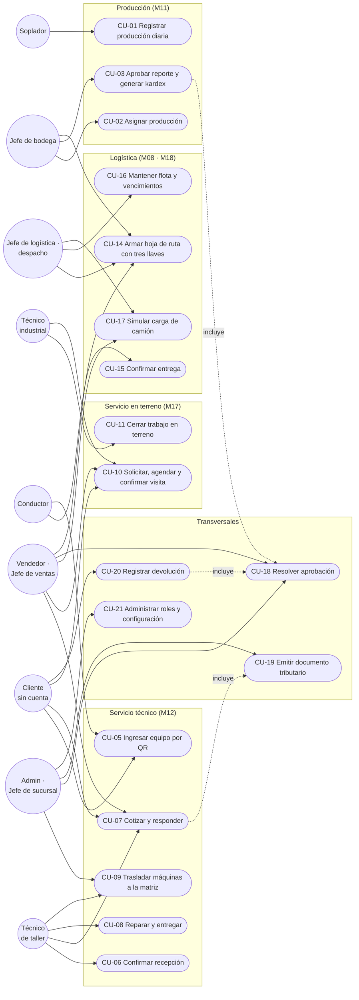

# DaliGo — Casos de uso

> **v1 · 2026-09-08.** Los casos de uso agrupan las historias (`HISTORIAS-DE-USUARIO.md`) en **interacciones completas**: quién dispara, qué tiene que ser cierto antes, el camino feliz paso a paso, los caminos alternativos y qué queda cierto después. Se detallan solo los que tienen **más de un actor, concurrencia o un tercero** — un CRUD con permiso no gana nada con un caso de uso.
>
> Fuentes: procesos de la biblia §8, permisos del seeder, controladores y los candados que ya fijan cada regla.

## Diagrama de casos de uso

## Índice

| CU | Nombre | Actor principal | Otros actores | HU | Estado |
|---|---|---|---|---|---|
| CU-01 | Registrar producción diaria | Soplador | — | 11-01…06 | ✅ · **detallado** |
| CU-02 | Asignar producción | Jefe de bodega | Soplador (recibe) | 11-07 | ✅ |
| CU-03 | Aprobar reporte y generar kardex | Jefe de bodega | Soplador (avisado) | 11-08…10 | ✅ · **detallado** |
| CU-05 | Ingresar equipo al taller por QR | Cliente | Técnico / jefe de bodega (confirman) | 12-01, 12-02 | ✅ · **detallado** |
| CU-06 | Confirmar recepción de un ingreso | Técnico / jefe de bodega | Cliente (correo) | 12-04 | ✅ |
| CU-07 | Cotizar, enviar y responder | Técnico | Cliente, vendedor, jefe de ventas | 12-05, 12-06, 12-03, 12-13, 12-14 | ✅ · **detallado** |
| CU-08 | Reparar y entregar | Técnico | Ventas (cobro) | 12-05 | ✅ |
| CU-09 | Trasladar máquinas sucursal → matriz | Jefe de sucursal | Técnico (recibe) | 12-08 | ✅ |
| CU-10 | Solicitar, agendar y confirmar visita industrial | Cliente / vendedor | Técnico industrial, jefe de ventas | 17-01…06, 17-08 | ✅ · **detallado** |
| CU-11 | Cerrar trabajo en terreno | Técnico industrial | Ventas (avisado) | 17-07 | ✅ |
| CU-14 | Armar hoja de ruta con tres llaves | Jefe de despacho | Jefe de ventas, jefe de bodega, conductor | 08-03 | ✅ · **detallado** |
| CU-15 | Confirmar entrega con firma y foto | Conductor | Cliente | 08-01 | ✅ |
| CU-16 | Mantener flota y vencimientos | Jefe de logística | Conductor, encargado por sucursal | 18-01, 08-02 | ✅ |
| CU-17 | Simular carga de camión | Vendedor | Bodega, cliente (link) | SIM-01, SIM-02, 08-05 | ✅ |
| CU-18 | Resolver una aprobación | Jefe (rol aprobador) | Solicitante | 14-01 | ✅ |
| CU-19 | Emitir documento tributario | Quien atiende | Bsale, SII, Contabilidad | 05-01 | ◐ · **detallado** (diseñado, 0 emitidos) |
| CU-20 | Registrar devolución | Cliente | Encargada, jefe (reembolso) | 13-01, 13-02 | ✅ |
| CU-21 | Administrar roles y configuración | Admin | — | 01-01…03 | ✅ |

---

## CU-01 · Registrar producción diaria

- **Actor principal:** Soplador (celular, en planta, a veces sin señal, a veces con guantes).
- **Precondiciones:** tiene una asignación del día (CU-02) en estado *borrador*; sesión iniciada; PWA instalada o navegador.
- **Disparador:** empieza el turno o termina una tanda.

**Flujo principal**
1. Abre «Mi producción»: ve la lista de producciones del día, cada una con preforma, tipo y meta **precargados**.
2. Entra a una producción; las cantidades están siempre visibles; máquina/tipo/motivos van en colapsables cerrados.
3. Registra una tanda **tocando** −1/+1/+10/+100 en 1ª, 2ª, malos y dañadas; el input central es atajo para números grandes.
4. Si hay 2ª o malos, elige el **motivo** con chips (lista del modelo; «Otro» revela texto).
5. Toca «Agregar tanda»: el servidor guarda con `lockForUpdate` sobre el reporte y responde; la pantalla muestra el acumulado.
6. Al terminar el día toca «Enviar al jefe»: si el total difiere de la meta, elige el motivo de la diferencia; el reporte pasa a *enviado* y se bloquea.
7. Recibe aviso (campanita/correo) cuando el jefe aprueba o devuelve.

**Flujos alternativos**
- **A1 · Sin señal (paso 5):** la tanda se encola en IndexedDB con un UUID; el contador «N sin conexión» sube. Al volver la señal se drena con token fresco: 2xx borra, 422/403 marca rechazada y **se ve**, 419/5xx reintenta. Nunca duplica (unique `[reporte_id, cliente_uuid]`).
- **A2 · Falta una precondición (máquina, tipo):** el submit se intercepta en el cliente, se abre el colapsable y se **sacude el control** (`$destacar`); el servidor valida igual.
- **A3 · Reporte devuelto:** vuelve a editable con el motivo del jefe visible; el soplador corrige y reenvía.
- **A4 · Campo `required` dentro de un colapsable cerrado:** el `invalid` en fase de captura abre la tarjeta del **primer** campo inválido (no aborta en silencio).

- **Postcondiciones:** tandas persistidas una sola vez; reporte *enviado* con totales y motivos; jefe con badge «N por aprobar».
- **Reglas:** varias producciones por día; el soplador **solo ingresa cantidades**; listas de motivos centralizadas; tope anti-dedazo (`max:100000`).
- **Candados:** `ProduccionTest` (idempotencia, motivos, Otro, panel), `ParametrosMiProduccionTest`, `PwaTest`, `MarcoHorizontalTest`.

---

## CU-03 · Aprobar reporte y generar kardex

- **Actor principal:** Jefe de bodega. **Secundario:** soplador (avisado), kardex (M04 futuro).
- **Precondiciones:** reporte en *enviado* (o *devuelto* re-enviado); jefe con `manage production`.
- **Disparador:** badge «por aprobar» en el menú o alerta en el panel.

**Flujo principal**
1. Abre el panel: ve «Requiere tu atención» (por aprobar, devueltos, atrasados) y «Pendientes de otros días» **con fecha**, arriba de la cola de hoy.
2. Entra al reporte; revisa tandas, motivos y diferencia contra la meta.
3. Toca «Aprobar». El controlador abre transacción, toma `lockForUpdate` sobre el reporte y **re-chequea** que sigue pendiente.
4. Genera el kardex (`ProduccionMovimiento::generarParaReporte`): consumo de preforma = **suma de tandas**; producción 1ª/2ª contra el producto del tipo; merma = malos + dañadas. Guard: si ya tiene movimientos, no regenera.
5. Marca *aprobado*, commit, avisa al soplador.

**Flujos alternativos**
- **A1 · Doble toque:** la segunda request espera el lock, ve *aprobado* y sale sin efecto. Un kardex.
- **A2 · Devolver:** con motivo obligatorio; también bajo lock (compite con aprobar). El soplador recibe aviso y el reporte vuelve editable.
- **A3 · Ajustar totales:** el jefe corrige cantidades con `motivo_ajuste`; el kardex **no** usa esos totales (usa las tandas) — el ajuste es capa de reporte.
- **A4 · Eliminar producción vacía:** solo *borrador* sin tandas (deshacer una asignación equivocada).

- **Postcondiciones:** reporte *aprobado* e inmutable; movimientos en `produccion_movimientos`; **`stocks` intacto** (ADR-003).
- **Reglas:** ADR-003, ADR-008; aprobar un reporte de otro día sigue contando en «pendientes de otros días».
- **Candados:** `ProduccionKardexTest` (doble aprobación, tandas vs. totales, preforma activa), `ProduccionTest` (panel, pendientes otros días).

---

## CU-05 · Ingresar equipo al taller por QR

- **Actor principal:** Cliente sin cuenta (en el mostrador, desde su teléfono). **Secundarios:** técnico o jefe de bodega (confirman, CU-06); conductor (variante por lote).
- **Precondiciones:** QR impreso en la sucursal con **link firmado** que embebe la sucursal.
- **Disparador:** el cliente llega con la máquina y escanea.

**Flujo principal**
1. Abre el formulario público; el navegador ya viene con la sucursal en el link (403 si se altera).
2. Ingresa nombre, RUT (con dígito verificador, **K incluida**), teléfono, correo.
3. Elige **garantía o reparación** — las ayudas se muestran a la vista (no en ⓘ) porque acá decide una vez y sin ayuda humana.
4. Si garantía: documento (boleta/factura), número y fecha. Describe la máquina (tipo, marca, modelo, serie si aplica) y la falla.
5. Envía. Honeypot vacío + throttle OK → se crea la orden con `fuente = 'qr'`, `confirmada_at = null`, y un folio.
6. Ve la pantalla de éxito por **otro** link firmado (no se pueden enumerar folios).
7. Recibe correo de ingreso con el **plazo de entrega** según la sucursal (10 días hábiles en Mirador) — en garantía, sin precios.

**Flujos alternativos**
- **A1 · Reparación con campos de garantía vacíos:** el navegador los envía igual como `""`; las reglas llevan `nullable` junto al `requiredIf`. No se rechaza.
- **A2 · Link alterado o vencido:** 403 → página amable, sin exponer nada.
- **A3 · Lote en ruta (conductor):** link firmado propio y permiso `crear lote servicio`; varias máquinas de una vez; no edita el taller.
- **A4 · Bot / spam:** honeypot lleno o throttle superado → rechazado sin crear nada.

- **Postcondiciones:** orden *recibida* pendiente de confirmación; badge «N ingresos por confirmar» en el menú del taller.
- **Reglas:** solo **escribe** (nunca lista ni lee otras órdenes); códigos de sucursal normalizados a mayúsculas (el plazo se resuelve por clave PHP, case-sensitive).
- **Candados:** `IngresoTallerPublicoTest`, `IngresoTallerLotePublicoTest`, `IngresoTallerCoherenciaFormulariosTest`, `RutConKTest`, `AyudaEnIconoTest` (las públicas conservan el texto), `PlazoSinFechaPrometidaTest`.

---

## CU-07 · Cotizar, enviar y responder

- **Actor principal:** Técnico de taller. **Secundarios:** cliente (responde por link), vendedor (autoriza/coordina pago), jefe de ventas (descuento), jefatura (catálogo de horas).
- **Precondiciones:** orden *en revisión* con recepción confirmada (CU-06); trabajo con **tiempo estándar** en el catálogo y precio de la hora en la lista `GENERAL`.
- **Disparador:** el técnico termina el diagnóstico.

**Flujo principal**
1. En el **parte del técnico** registra causa de la falla (mal uso / uso normal / fábrica), trabajo realizado y repuestos (con SKU y precio de la lista oficial).
2. La mano de obra se **deriva**: horas del catálogo × valor hora (SKU 9771001). No se tipea. La pantalla siembra lo que **va a quedar al guardar**, no la columna vieja.
3. Guarda el presupuesto (una sola acción). Si es **garantía**, no hay precios ni descuento; el total viaja en hidden para no borrarse.
4. Toca «Enviar cotización»: `faltaManoObra()` verifica que el catálogo **pueda** calcularla; si puede, la orden pasa a *cotización* y el cliente recibe el link firmado.
5. El cliente abre el link (sin cuenta, sin valores UF internos), ve repuestos + mano de obra + total y **acepta o rechaza**.
6. Aceptó → aviso a taller y al vendedor; el vendedor **autoriza la reparación** (coordina el pago; el técnico no toca plata). Rechazó → se cobra solo la hora de servicio.

**Flujos alternativos**
- **A1 · El catálogo no puede calcular la mano de obra** (trabajo sin tiempo estándar o SKU de la hora sin precio): el **envío** se bloquea con el motivo exacto; **guardar** sigue libre para que el técnico avance mientras jefatura carga el dato. 0 h fijadas por jefatura **sí** se envía.
- **A2 · Descuento:** solo jefe de ventas/admin ven el selector; el técnico no. Un campo ausente no se lee como 0 (`$request->has`).
- **A3 · Causa de falla histórica fuera del enum:** la vista muestra «Sin determinar», no 500.
- **A4 · Cliente no responde:** la orden queda en *cotización*; el listado la muestra por edad.

- **Postcondiciones:** presupuesto persistido; estado *cotización* → *reparado* tras autorizar; cliente con respuesta registrada.
- **Reglas:** biblia §10.2 (una línea por repuesto + una de mano de obra; nada exento en ST); el envío bloquea por «no se puede calcular», nunca por monto.
- **Candados:** `CotizacionGuardarTest`, `CotizacionEnviarTest`, `CotizacionVistaPreviaTest`, `CotizacionPublicoTest`, `CotizacionAutorizarTest`, `CotizacionRetiroTest`, `PrecioListaOficialTest`.

---

## CU-10 · Solicitar, agendar y confirmar una visita industrial

- **Actor principal:** Cliente (solicita) y vendedor / jefe de ventas (agenda). **Secundarios:** técnico industrial (avisado), jefe de ventas (autoriza), motor de aprobaciones.
- **Precondiciones:** tarifario de servicios en UF cargado; cierres de agenda (feriados, vacaciones) registrados.
- **Disparador:** el cliente pide una visita desde el formulario público, o ventas la agenda directo.

**Flujo principal**
1. El cliente llena el formulario público: datos, equipo, **fecha preferida** (solo L–V, sin cierres). No elige el tipo: lo fija el servidor (`TIPO_PUBLICO`). Ve un cartel de disponibilidad.
2. Si viene **sin fecha** → estado *solicitado* «por coordinar», badge en el menú y aviso a ventas.
3. Ventas abre el calendario mensual, elige franja de 2 h y técnico (por defecto el industrial); trabajos multi-día ocupan varios días. Si el tipo lo exige, pasa por **aprobación de jefatura** (`CitaTerreno`).
4. Al quedar *agendado*, el modelo decide los avisos (no el controlador, porque hay **tres caminos**: crear, editar, autorizar después): al **técnico** (o a todos los industriales si no hay asignado) y al **cliente**.
5. Ventas toca «**Confirmar y avisar al cliente**»: un correo con fecha, franja, técnico y el recuadro de garantías (plazos y qué hacer con ellos).
6. El cliente, por link con token, **confirma, reprograma o anula** (con motivo). Reprogramar vuelve a 4.

**Flujos alternativos**
- **A1 · Reasignación de técnico:** el aviso va también al técnico **anterior**.
- **A2 · Cierre de agenda:** el día desaparece del formulario público; por dentro se puede agendar igual.
- **A3 · Fecha en fin de semana:** rechazada con mensaje («el técnico va a terreno de lunes a viernes»).
- **A4 · Cita cancelada:** aviso al técnico y al vendedor; motivo de la lista.

- **Postcondiciones:** trabajo *agendado* con franja y técnico; cliente y técnico notificados; historial del cliente actualizado.
- **Reglas:** L–V (`DiasHabiles`); un token por cita; audiencias editables por el dueño; la decisión de avisar vive en `AgendaTrabajo`.
- **Candados:** `VisitaIndustrialTest`, `DisponibilidadVisitaTest`, `HorarioVisitaTest`, `CierresAgendaTest`, `AgendaTerrenoTest`, `AvisosAlTecnicoTerrenoTest`, `ConfirmacionVisitaTest`, `GarantiasIndustrialTest`.

---

## CU-14 · Armar la hoja de ruta con tres llaves

- **Actor principal:** Jefe de despacho (`manage hojas ruta`). **Secundarios:** jefe de ventas (llave 1), jefe de despacho (llave 2), jefe de bodega (llave 3), conductor (la recibe).
- **Precondiciones:** despachos *preparados* con sus documentos; conductor y vehículo disponibles.
- **Disparador:** hay carga para salir.

**Flujo principal**
1. Arma la hoja en *borrador* eligiendo documentos/despachos, conductor, vehículo y orden de paradas.
2. **Llave 1 — pagos OK** (jefe de ventas): los pagos de la ruta están conformes → *pagos_ok*.
3. **Llave 2 — ruta autorizada** (jefe de despacho): ruta y orden pactados → *ruta_autorizada*.
4. **Llave 3 — cargada** (jefe de bodega): la carga subió al camión; registra la salida → *cargada* → *en_ruta*.
5. El conductor ve sus entregas (CU-15) y las confirma con firma y foto; la hoja se cierra cuando todas están resueltas → *cerrada*.

**Flujos alternativos**
- **A1 · Misma persona con dos llaves:** no puede — cada llave es un **permiso distinto** y el seeder no se los da al mismo rol (mismo criterio que el traslado de máquinas).
- **A2 · Orden incorrecto:** una llave fuera de secuencia se rechaza.
- **A3 · Entrega parcial:** el despacho queda *entrega_parcial*; la hoja no cierra hasta resolverlo.

- **Postcondiciones:** trazabilidad de quién autorizó qué y cuándo; despachos en su estado real.
- **Reglas:** `HojaDeRuta::ESTADOS` = borrador → pagos_ok → ruta_autorizada → cargada → en_ruta → cerrada; control cruzado por permisos.
- **Candados:** `HojaRutaTest`, `HojaRutaHttpTest`, `HojaRutaScopingTest`, `HojaRutaServiceTest`, `tests/Feature/Despachos/*`.

---

## CU-19 · Emitir documento tributario (diseñado — 0 emisiones reales)

- **Actor principal:** Quien atiende (`emitir documentos tributarios`). **Secundarios:** Bsale (emisor), SII, Contabilidad, gerente (autoriza la primera).
- **Precondiciones:** orden de servicio *reparada* con presupuesto; `config/dte.php` con los tres mapas llenos; **candado de entorno abierto**; autorización escrita de Gerencia (biblia §10.6).
- **Disparador:** el cliente retira y paga.

**Flujo principal**
1. Elige **boleta o factura** (lo decide la persona; factura exige RUT + giro).
2. El sistema arma el documento: una línea por repuesto (SKU) + una de mano de obra (SKU 9771001); **neto por línea desde el total con IVA**, residuo a la línea mayor; oficina = sucursal donde se **reparó**; pago registrado al emitir.
3. `EmisionDte` **reserva** la fila en `dte_emitidos` (índice único de `sales_id`) antes de llamar afuera.
4. `BsaleEmisor` traduce y `BsaleClient::post()` envía **sin reintentos** (solo 429).
5. Bsale responde folio y estado SII (`0` = aceptado); se guardan `url_xml` (el documento legal) y `url_pdf`.
6. La pantalla muestra el documento; el cliente lo recibe por correo según preferencia.

**Flujos alternativos**
- **A1 · Doble clic:** la segunda reserva choca con el índice → se muestra el existente. Un folio.
- **A2 · Timeout tras el POST:** no se reintenta; la fila queda reservada sin folio y se **revisa a mano** (mejor un hueco visible que un folio doble).
- **A3 · Mapa de config vacío:** falla con el nombre de la clave. Sin defaults.
- **A4 · Anulación:** solo por **nota de crédito** (gerente, jefe de ventas, jefes de sucursal). Shape de `returns.json` aún no verificado.
- **A5 · Garantía:** no se emite venta; corresponde **guía de despacho** (pendiente, plazo 1-nov-2026).

- **Postcondiciones:** DTE en el SII vía Bsale; fila local con folio, estado y XML (conservación 6 años).
- **Reglas:** biblia §10 completa (regla de oro: DaliGo **no emite, traduce**); ADR-005.
- **Candados:** `tests/Feature/Dte/*` (`EmisionDteTest`, `CandadoDeEmisionTest`, `PuertoDteTest`, `DteEmitidoTest`), `tests/Unit/Dte/*` (desglose neto).

---

## Cómo se mantiene

- Un módulo nuevo entra con su fila en el índice **y**, si tiene más de un actor o un tercero, con su caso detallado — antes de programar (ficha R-10).
- Los estados citados salen de las constantes `ESTADOS` de los modelos; si cambian, cambia este archivo en el mismo push.
- Cada «Candados» debe nombrar clases que **existen**: la matriz de trazabilidad (pendiente) lo va a verificar por construcción.
